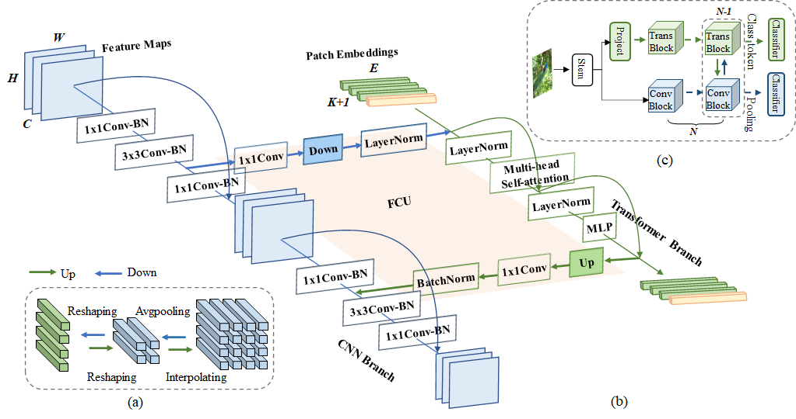
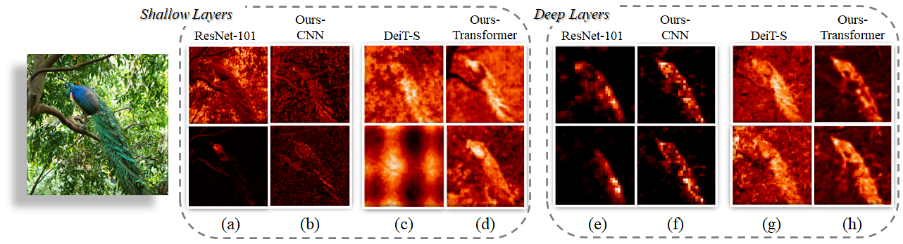

# Conformer: Local Features Coupling Global Representations for Visual Recognition

This repository is built upon [DeiT](https://github.com/facebookresearch/deit) and [timm](https://github.com/rwightman/pytorch-image-models)
# Introduction
Within Convolutional Neural Network (CNN), the convolution operations are good at extracting local features but experience difficulty to capture global representations.
Within visual transformer, the cascaded self-attention modules can capture long-distance feature dependencies but unfortunately deteriorate local feature details. 
In this paper, we propose a hybrid network structure, termed Conformer, to take advantage of convolutional operations and self-attention mechanisms for enhanced representation learning. 
Conformer roots in the Feature Coupling Unit (FCU), which fuses local features and global representations under different resolutions in an interactive fashion.
Conformer adopts a concurrent structure so that local features and global representations are retained to the maximum extent.
Experiments show that Conformer, under the comparable parameter complexity, outperforms the visual transformer (DeiT-B) by 2.3\% on ImageNet.
On MSCOCO, it outperforms ResNet-101 by 3.7\% and 3.6\% mAPs for object detection and instance segmentation, respectively, demonstrating the great potential to be a general backbone network. 

The basic architecture of the Conformer is shown as following:



We also show the comparison of feature maps of CNN (ResNet-101), Visual Transformer (DeiT-S), and the proposed Conformer as following. 
The patch embeddings in transformer are reshaped to feature maps for visualization. While CNN activates discriminative local regions ($e.g.$, the peacock's head in (a) and tail in (e)), 
the CNN branch of Conformer takes advantage of global cues from the visual transformer and thereby activates complete object ($e.g.$, full extent of the peacock in (b) and (f)). 
Compared with CNN, local feature details of the visual transformer are deteriorated ($e.g.$, (c) and (g)). In contrast, 
the transformer branch of Conformer retains the local feature details from CNN while depressing the background ($e.g.$, 
the peacock contours in (d) and (h) are more complete than those in(c) and (g).



# Getting started

## Install

First, install PyTorch 1.7.0+ and torchvision 0.8.1+ and [pytorch-image-models 0.3.2](https://github.com/rwightman/pytorch-image-models):

```
conda install -c pytorch pytorch torchvision
pip install timm==0.3.2
```

## Data preparation

Download and extract ImageNet train and val images from http://image-net.org/.
The directory structure is the standard layout for the torchvision [`datasets.ImageFolder`](https://pytorch.org/docs/stable/torchvision/datasets.html#imagefolder), and the training and validation data is expected to be in the `train/` folder and `val` folder respectively:

```
/path/to/imagenet/
  train/
    class1/
      img1.jpeg
    class2/
      img2.jpeg
  val/
    class1/
      img3.jpeg
    class/2
      img4.jpeg
```

## Training and test
### Training
To train Conformer-S on ImageNet on a single node with 8 gpus for 300 epochs run:

```
export CUDA_VISIBLE_DEVICES=0,1,2,3,4,5,6,7
OUTPUT='./output/Conformer_small_patch16_batch_1024_lr1e-3_300epochs'

python -m torch.distributed.launch --master_port 50130 --nproc_per_node=8 --use_env main.py \
                                   --model Conformer_tiny_patch16 \
                                   --data-set IMNET \
                                   --batch-size 128 \
                                   --lr 0.001 \
                                   --num_workers 4 \
                                   --data-path /data/user/Dataset/ImageNet_ILSVRC2012/ \
                                   --output_dir ${OUTPUT} \
                                   --epochs 300
```
### Test
To test Conformer-S on ImageNet on a single gpu run:
```
CUDA_VISIBLE_DEVICES=0, python main.py  --model Conformer_small_patch16 --eval --batch-size 64 \
                --input-size 224 \
                --data-set IMNET \
                --num_workers 4 \
                --data-path /data/user/Dataset/ImageNet_ILSVRC2012/ \
                --epochs 100 \
                --resume ../Conformer_small_patch16.pth
```


# Model zoo
| Model        | Parameters | MACs   | Top-1 Acc | Link |
| ------------ | ---------- | ------ | --------- | ---- |
| Conformer-Ti | 23.5 M     | 5.2 G  | 81.3 %    | [baidu](https://pan.baidu.com/s/12AblBmhUu5gnYsPjnDE_Jg)(code: hzhm) [google](https://drive.google.com/file/d/1V4OcqVIMtBdV3I08vfwqEJqPW7lm8tZk/view) |
| Conformer-S  | 37.7 M     | 10.6 G | 83.4 %    | [baidu](https://pan.baidu.com/s/1kYOZ9mRP5fvujH6snsOjew)(code: qvu8) [google](https://drive.google.com/file/d/1mpOlbLaVxOfEwV4-ha78j_1Ebqzj2B83/view?usp=sharing) |
| Conformer-B  | 83.3 M     | 23.3 G | 84.1 %    | [baidu](https://pan.baidu.com/s/1FL5XDAqHoimpUxNSunKq0w)(code: b4z9) [google](https://drive.google.com/file/d/1oeQ9LSOGKEUaYGu7WTlUGl3KDsQIi0MA/view?usp=sharing) |

# Citation
```
@article{peng2021conformer,
      title={Conformer: Local Features Coupling Global Representations for Visual Recognition}, 
      author={Zhiliang Peng and Wei Huang and Shanzhi Gu and Lingxi Xie and Yaowei Wang and Jianbin Jiao and Qixiang Ye},
      journal={arXiv preprint arXiv:2105.03889},
      year={2021},
}
```
